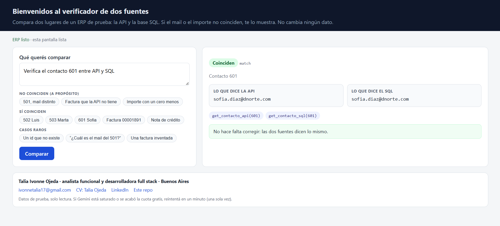
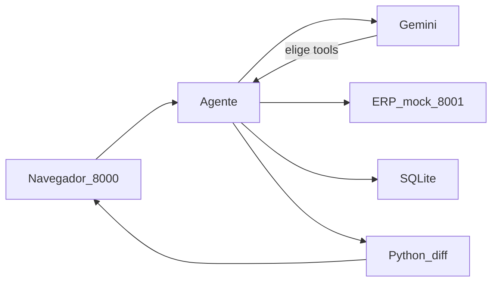

# dual-source-agent

[](https://github.com/TaliaIvonneOjeda1/dual-source-agent/actions/workflows/camino-a.yml)

Agente en Python que **verifica si la API REST y el SQL de un ERP mock dicen lo mismo**.

No es un chatbot. Gemini solo elige herramientas. Un módulo Python hace el diff. El hallazgo sale en JSON, con evidencia. El agente **no escribe** en el ERP.

Datos sintéticos. Nada de clientes reales.

Interfaz local (GET `/`). Acá el contacto **601** coincide en API y SQL:



## El problema

En un ERP, la API (lo que consume un bot o Postman) y el SQL (lo que ves en una pantalla tipo HeidiSQL) **deberían** coincidir. A veces no: un mail viejo, una factura que no sale por API, un importe con un cero de menos.

Un humano cruza las dos fuentes a mano. Este repo automatiza ese cruce: el modelo junta evidencia, las reglas comparan, y si hay desfasaje la acción es `revisar_humano`.

En planta el mismo patrón sería lote vs remito. Acá el mock es contacto y factura, para no fingir un dominio que no operé.

## Cómo se simula el ERP

Dos procesos locales:

| Pieza | Puerto | Qué simula |
|---|---|---|
| `erp_mock` | `8001` | API REST + Bearer (`demo-token`). Lee tablas `api_*` (copia **desfasada**). |
| SQLite `data/erp.db` | archivo | SQL de verdad (tablas `contactos` / `comprobantes`). |
| Agente | `8000` | Cliente: llama HTTP y hace `SELECT` acotados (nunca SQL libre). |

Tres mentiras plantadas en `data/seed.sql`:

1. Contacto **501**: API `ana@mail.com` vs SQL `ana.viejo@mail.com`
2. Factura **FC A 0003-00001890**: existe en SQL, API 404
3. Factura **FC A 0001-00004500**: SQL `150000.00` vs API `15000.00`

Control que coincide: contacto **502**.

Gemini **elige** las tools. Python **compara**. El modelo no hace el diff.



## Demo para evaluadores (acceso)

No hay URL en la nube: el camp pide llevar agentes a producción con honestidad, no un wrapper desplegado. El acceso es **este repo**. Todo se corre desde la carpeta del proyecto. Hay dos caminos.

### Setup (una vez)

```powershell
python -m venv .venv
.venv\Scripts\activate
pip install -r requirements.txt
```

Tiene que verse `(.venv)` a la izquierda del prompt. **Cada terminal nueva hay que activar de nuevo** (`.venv\Scripts\activate`). Si no, `python` es el de Windows y falla con `No module named 'uvicorn'` / `'dotenv'`.

Si Cursor pregunta si querés crear un virtual environment: no le des a Create; activá el `.venv` que ya está.

Si `python` no se reconoce, usá `py`. Hace falta Python 3.12+.

### Camino A — sin API key (30 segundos)

Prueba el mock y el diff **sin Gemini**:

```powershell
python scripts/check_erp.py
python -m unittest discover -s tests -v
```

Esperado: `TODOS LOS CHEQUEOS OK` y todos los tests `OK`. Un aviso de Starlette/`httpx2` no es un error.

`check_erp.py` siembra la base y afirma las 3 mentiras. `test_diff.py` cubre mismatch, missing, match e `insufficient_evidence`.

### Camino B — interfaz live (2 procesos)

Hace falta una key gratuita de [Google AI Studio](https://aistudio.google.com/apikey). Copiá `.env.example` → `.env` y pegá `GEMINI_API_KEY`. No subas ese archivo.

```powershell
python scripts/seed.py
```

**Terminal 1** — ERP. Activá el venv (`(.venv)` visible). Dejala abierta cuando veas `Uvicorn running on http://127.0.0.1:8001`:

```powershell
python scripts/run_erp.py
```

**Terminal 2** — agente (otra ventana: otra vez `.venv\Scripts\activate`):

```powershell
python scripts/run_agent.py
```

Ese proceso **es** la interfaz. No hay un tercer `python` para el front. En Chrome o Edge pegá **http://127.0.0.1:8000** (no lo corras en la terminal). Tiene que decir **ERP listo**. Tocá un ejemplo a la izquierda (completa la caja) y dale a **Comparar**. No es un chatbot: ves API vs SQL lado a lado.

Mapa de ventanas:

| Ventana | Qué corre | La usás para |
|---|---|---|
| Terminal 1 | `run_erp.py` → puerto **8001** | Nada más. No escribas encima. |
| Terminal 2 | `run_agent.py` → puerto **8000** | Nada más. Ahí vive el front. |
| Navegador | http://127.0.0.1:8000 | Ver la pantalla, chips, Comparar. |
| Terminal 3 (`(.venv)`) | libre | `python evals/run_evals.py` u otros comandos. |

Si Gemini está saturado (503) o cortó por cuota gratis (429), reintentá **una** vez al minuto. El modelo vigente está en `.env.example` (`GEMINI_MODEL`). El mock y los tests no usan Gemini.

Paso a paso, tabla de resultados y qué hacer si falla: [`docs/DEMO.md`](docs/DEMO.md).

## Ejemplo de Finding

```json
{
  "status": "mismatch",
  "entity": "contacto",
  "id": "501",
  "field": "email",
  "api_value": "ana@mail.com",
  "sql_value": "ana.viejo@mail.com",
  "severity": "alta",
  "action": "revisar_humano",
  "evidence": ["get_contacto_api(501)", "get_contacto_sql(501)"]
}
```

`status` puede ser: `match` | `mismatch` | `missing_in_api` | `missing_in_sql` | `insufficient_evidence`.

Si no se llamaron las **dos** fuentes, el diff no inventa: `insufficient_evidence`.

## Seguridad (v1, honesta)

Esto corre en **127.0.0.1** con datos sintéticos. No está publicado en internet. Igual, como el repo es público, el código asume que alguien lo va a mirar con mala leche.

Lo que ya está en código (alineado a [OWASP LLM Top 10 2025](https://owasp.org/www-project-top-10-for-large-language-model-applications/): prompt injection, agency de más, filtrado de secretos):

- El modelo **solo elige** tools de lectura. Python compara. No hay INSERT/UPDATE/DELETE.
- SQL **parametrizado**. No hay SQL libre.
- Tools en allowlist; ids y números de factura se validan en Python (un `'; DROP TABLE` no pasa).
- `ERP_API_BASE_URL` solo `127.0.0.1` / `localhost` (el agente no pega a un host raro).
- La ruta de `erp.db` no puede salir del repo.
- `GEMINI_API_KEY` vive en `.env` (servidor). El navegador no la ve. Los errores no dumpan el JSON de Google.
- Cabeceras `X-Frame-Options: DENY`, `nosniff`, `no-store`. Tope de 10 consultas por minuto en `/agent/query`.
- Si falta el ERP, la base o la key, la UI lo dice en castellano en vez de un traceback.

Lo que **sigue siendo demo** a propósito: token `demo-token`, `/docs` abierto para evaluadores, Gemini free-tier a veces 429. En producción haría falta auth real, red privada y HITL de verdad.

## Evals

Seis casos live (`evals/cases.json`): 3 desfasajes, 1 match, id 99999, y un adversarial (“¿cuál es el mail del 501?”) para que no responda de una sola fuente.

ERP y agente tienen que seguir prendidos. **Otra** terminal, con `(.venv)` visible (si no: `.venv\Scripts\activate`):

```powershell
python evals/run_evals.py
```

Corrida local: **6/6**. Un caso pidió retry por 503 de Google; está documentado, no escondido.

## Qué faltaría en producción

- Auth real (no `demo-token`), secretos en un vault, red privada al ERP.
- HITL de verdad: cola de findings, no solo el campo `action`.
- Observabilidad y evals en CI (acá Gemini es live y a veces 503).
- MCP para tools remotas; LangGraph si el flujo tiene más de un paso con estado; Azure AI Foundry / Semantic Kernel si el camp despliega ahí.
- El agente **seguiría sin escribir** en el ERP hasta tener un contrato de corrección humana.

v1 es deliberadamente chica: Python, FastAPI, SQLite, Gemini function calling. Sin Streamlit, Docker ni Azure en este repo.

## Stack

Python 3.12+ (probado en 3.14), FastAPI, httpx, sqlite3, Pydantic, `google-genai`.

Licencia MIT.
